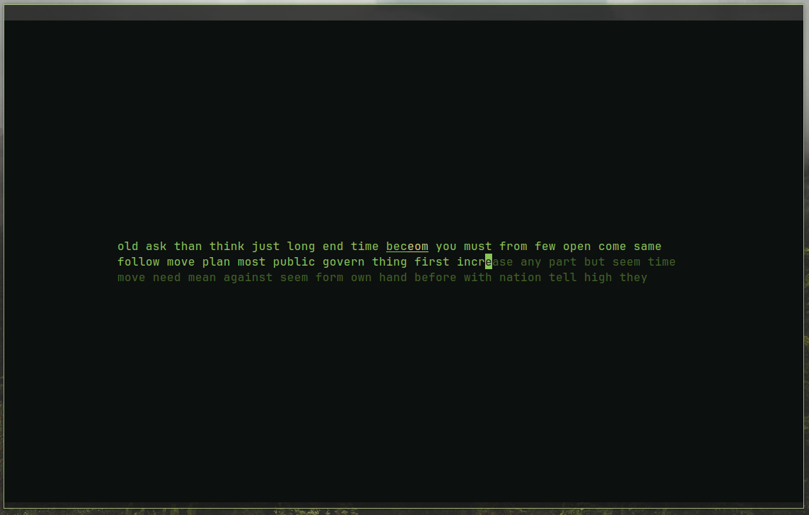

# MonkeyType TUI

### Local setup
Clone the project using
```bash
$ git clone https://github.com/Taz03/monkeytype-tui
$ cd monkeytype-tui
```

- Go to the <a href="https://monkeytype.com/settings">MonkeyType</a> settings tab
- Click the `Go to the danger zone` button under the `More Account Settings` header.
- Click the `export` button to copy your MonkeyType settings to the system clipboard.
- While in the project root directory, create a json file `config.json` and paste the exported json inside

#### You can now run the app with
```bash
$ go run .
``` 

### Usage
After setup, there is no way to tweak settings through the program. However, you can go back to monkeytype and change settings on the website. You can then repeat steps 4-6 in order to apply the changes to the app. <br>

### Bugs!
If you encounter any bugs, please open a github issue. Describe clearly the issue you're experiencing and the circumstances that may have caused it if applicable. <br>
